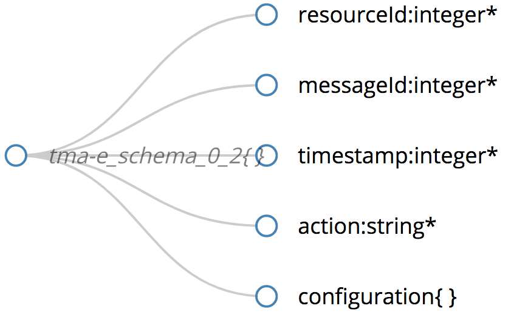

# Execute Component @ TMA Framework

The key components of the of the [**ATMOSPHERE**](http://www.atmosphere-eubrazil.eu) ecosystem will provide adaptation mechanisms to cope with the trustworthiness level goals.
These mechanisms are controlled by `actuators` which are in turn invoked by the `TMA_Execute`. 

Runtime adaptation is required to achieve/maintain the desired levels of trustworthiness. 
The `TMA_Planning` structures the actions needed to achieve goals and objectives. 
It creates or selects a procedure to perform a desired update in the managed resource. 
The `TMA_Execute` is the responsible to change the behavior of managed resources using the actuators based on the actions recommended by the `TMA_Planning`.

Based on the idea of a runtime assessment of trustworthiness, we understand that the managed resources should be adapted to improve trustworthiness. The ability of such a system to adapt its own behavior and/or structure in response to changes occurring to the system itself, its environment, or even its goals at runtime is called self-adaptation. 
Examples of such changes include requirements and execution environments, failures, as well as bug fixes and security issues.

These adaptations are implemented by actuators, which are key components that have the ability to change the managed element by adapting rules/policies implemented at the different layers/resources of the system. 

## Actuators Definition

Although the development of each `actuator` depends on the component with which it integrates, all the `actuators` will follow a standard architecture and provide a similar interface in order to integrate with the `TMA_Execute`. 

The messages to be submitted from `TMA_Execute` to one `actuator` follow the `JSON` schema specified in [tma-e_schema](interface/atmosphere_tma-e_schema.json), which is currently in the version `0.2`.

The [figure below](interface/atmosphere_tma-e_schema.png)  presents a representation of this schema, which is also explained below. 

*Format of the data to be provided to the actuator components.*

Each message will include:

* `resourceId` -- identifies the resource to which the adaptation is targeted
* `messageId` -- control information 
* `timestamp` -- control information 
* `action` -- identifies the adaptation to be promoted by the actuator
* `configuration` -- configuration data for the `action`, which can be included in the form of a JSON object.

`Actuators`, `actions` and respective `configuration` data must be configured in the system, and saved in the knowledge base. 
`Actuators` can be added by the administrator that should add information about them, including the types of available adaptations, foreseen effects and the definition of rules that specify if one adaptation should be triggered.

-

The executor component will encrypt the message to be sent to the ActuatorAPI. In order to encrypt the message, both the private and public keys are needed, besides the information about the adaptation operation.

Then, the executor will invoke the ActuatorAPI, which will be responsible to decrypt the message. After decryptying the message, the ActuatorAPI will invoke the proper operation to be performed in the corresponding resource.

-

The interaction with TMA will be done through Actuators, which will be provided by each system. In order to establish the communication, each system has to implement its own Actuator. It should be a **ConcreteActuator**, which implements the interface **Actuator**. The method to be implemented is _act_, which has the following parameters:

* `resourceId` -- identifies the resource that is the subject of the adaptation
* `action` -- name of the action to be performed. This will be used to inform the ActuatorAPI about which action to be performed
* `config` -- list (key/value) of attributes to execute the operation